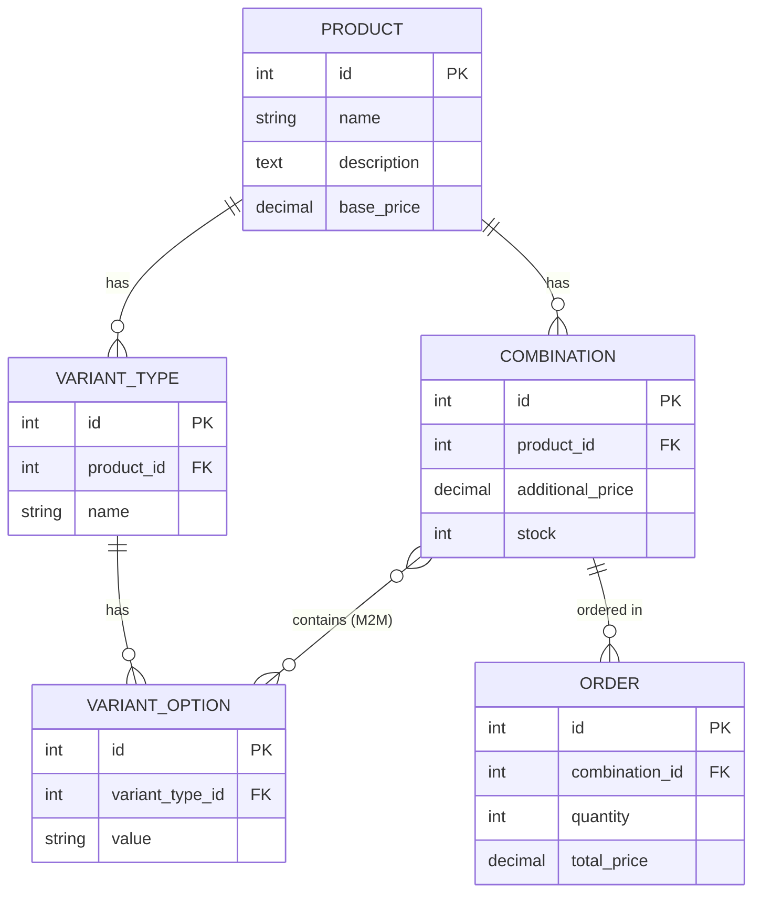

This repository contains a full-stack solution for the E-Commerce Product Variants technical assessment. It features a robust Django REST Framework backend and a dynamic React.js frontend.
-----------------------------------------------------------------
Quick Start Guide :

🐳 Run with Docker (Recommended)
You can launch the entire stack (Database, Backend, Frontend, and Seed Data) with one command:

`docker-compose up --build`

- Storefront: http://localhost:5173
- API Base URL: http://localhost:8000/api

----------------------------------------------------------------

You can run both the backend and frontend locally in under 15 minutes.

1. Backend Setup (Django)

Navigate to the backend directory:

cd backend

Create and activate a virtual environment:

python -m venv venv

Windows: venv\Scripts\activate

macOS/Linux: source venv/bin/activate

Install dependencies:

pip install -r requirements.txt

Environment Variables: Create a .env file in the backend directory (you can copy .env.example if available) and add:

DEBUG=True
SECRET_KEY=your_secret_key

(Note: SQLite is used by default for immediate testing. No external DB setup is required).

Run Migrations & Seed Data:
The seed script automatically generates products, dynamic variants, and mathematically correct SKUs.

python manage.py makemigrations products
python manage.py migrate
python manage.py seed

Start the Server:

python manage.py runserver

The API will be available at http://localhost:8000/

2. Frontend Setup (React.js)

Navigate to the frontend directory:

cd frontend

Install dependencies:

npm install

Environment Variables: Create a .env file in the frontend directory and add:

VITE_API_URL=http://localhost:8000

Start the Development Server:

npm run dev

The storefront will be available at http://localhost:5173/
-----------------------------------------------------------------

🗄️ Database Schema / ERD

The database is normalized to handle completely dynamic variants and options.

Relationship Details:

Combinations to Variant Options: Managed via a Many-to-Many (M2M) table. A specific combination (e.g., Size: L + Color: Red) links to the respective VariantOption IDs.

Order to Combination: Protected relationship (on_delete=models.PROTECT). Combinations with history cannot be hard-deleted, ensuring accounting integrity.
